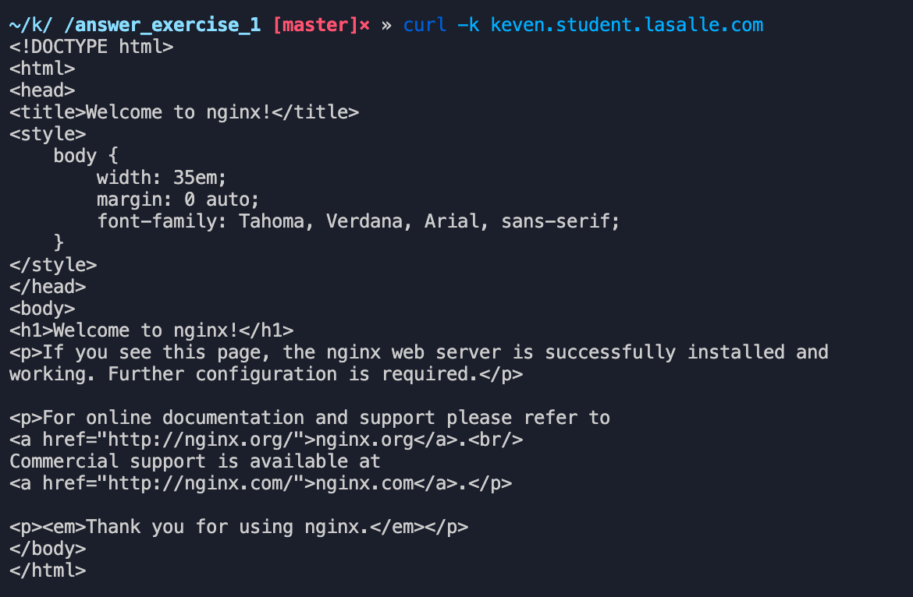

## Crea los siguientes objetos de forma declarativa con las siguientes especificaciones:

- imagen: nginx
- Version: 1.19.4
- 3 replicas
- Label: app: nginx-server
- Exponer el puerto 80 de los pods
- Limits: CPU: 20 milicores, Memoria: 128Mi
- Requests:CPU: 20 milicores, Memoria: 128Mi

### A continuación, tras haber expuesto el servicio en el puerto 80, se deberá acceder a la página principal de Nginx a través de la siguiente URL:

http://<student_name>.student.lasalle.com

Objetos:


Accediendo a http://keven.student.lasalle.com


Otra forma, mediante la terminal a partir de la ejecución de la siguiente instrucción:

```jsx
curl -k keven.student.lasalle.com
```



### Una vez realizadas las pruebas con el protocolo HTTP, se pide acceder al servicio mediante la utilización del protocolo HTTPS, para ello:

Creamos el certificado autofirmado y la clave privada con el comando:

openssl req -x509 -nodes -days 365 -newkey rsa:2048 -keyout key.pem -out cert.pem -subj "/CN=keven.student.lasalle.com/O=keven.student.lasalle.com"

```jsx
kubectl create secret tls kevensallecert --key key.pem --cert cert.pem
```


Creamos el secret por comando y luego visualizamos:

```jsx
kubectl create secret tls kevensallecert --key key.pem --cert cert.pem
```


Luego lo exportamos para tenerlo como referencia:

```jsx
kubectl get secret kevensallecert -o yaml > secret.yml
```


Creamos otro archivo ingress_tls.yaml para la configuración del TLS que hemos creado:


Verificamos en el navegador el certificado autofirmado:


Guardamos el certificado desde el navegador keven-student-lasalle-com.pem y lo probamos desde el terminal con curl viendo como resultado la web nginx.

```jsx
curl --cacert keven-student-lasalle-com.pem  https://keven.student.lasalle.com
```


