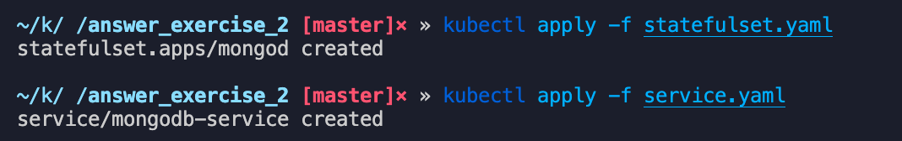
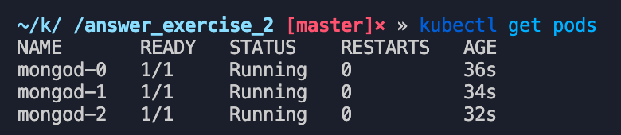
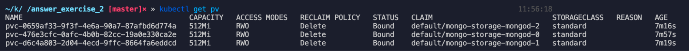
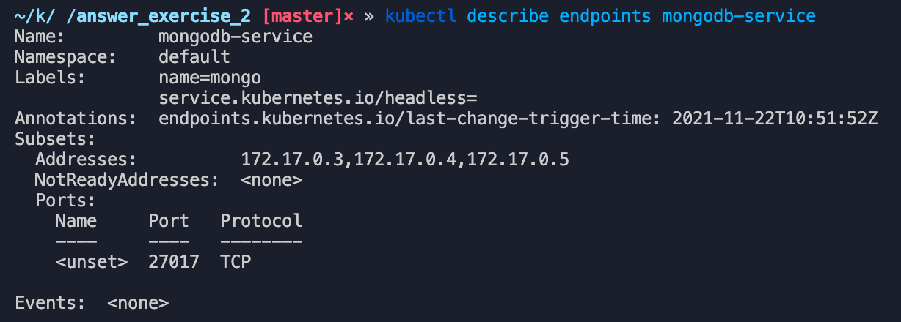
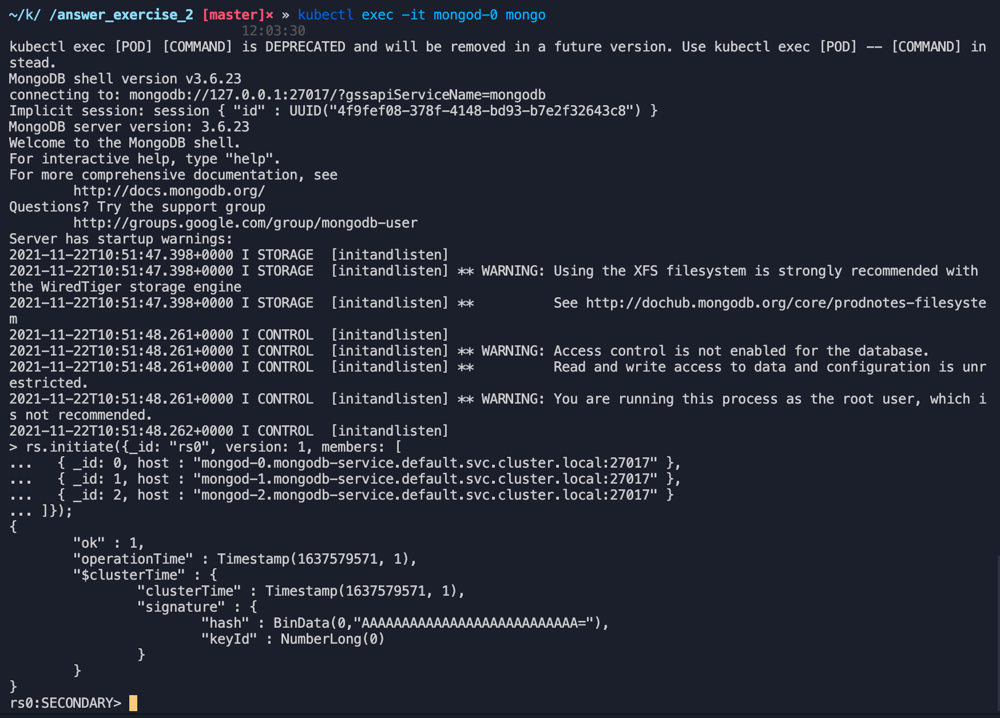
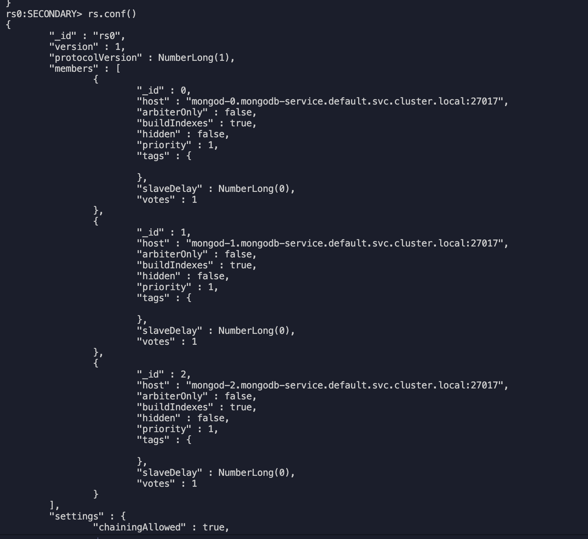
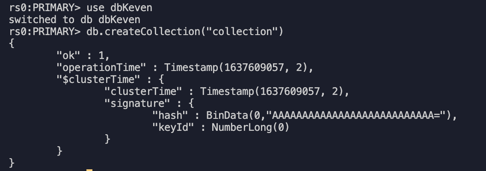
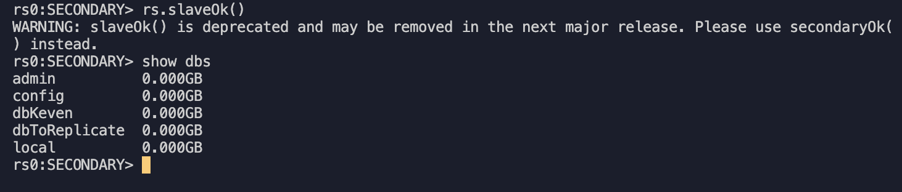

## Crear un StatefulSet con 3 instancias de MongoDB

Levantamos el statefullset del mongo db y su servicio headless.




Revisamos los volúmenes persistentes por cada nodo:



Describiendo el servicio podemos ver los 3 nodos con sus ips.


### Habilitar el clúster de MongoDB

Armamos el FQDN de cada uno de los pods:

- mongod-0.mongodb-service.default.svc.cluster.local:27017
- mongod-1.mongodb-service.default.svc.cluster.local:27017
- mongod-2.mongodb-service.default.svc.cluster.local:27017

Ya tenemos las réplicas funcionando, pero todavía no están trabajando conjuntamente como un clúster. Para ello es necesario inicializar el mismo desde dentro de uno de los pods.

```jsx
kubectl exec -it mongod-0 mongo
```

Y ejecutamos

```jsx
rs.initiate({
  _id: "rs0",
  version: 1,
  members: [
    {
      _id: 0,
      host: "mongod-0.mongodb-service.default.svc.cluster.local:27017",
    },
    {
      _id: 1,
      host: "mongod-1.mongodb-service.default.svc.cluster.local:27017",
    },
    {
      _id: 2,
      host: "mongod-2.mongodb-service.default.svc.cluster.local:27017",
    },
  ],
});
```



Comprobando la configuración:


### Realizar una operación en una de las instancias a nivel de configuración y verificar que el cambio se ha aplicado al resto de instancias

Nos conectamos al nodo primario y creamos la bd y una colección de ejemplo

```jsx
kubectl exec -it mongod-0 mongo
```



Luego ingresamos a la consola de un nodo secundario y ejecutamos slaveOk para indicar que somo nodo esclavo y listamos la dbs pudiendo observar que ya apareció nuestra base de datos llamada dbKeven:

```jsx
kubectl exec -it mongod-1 mongo

rs.slaveOk()

show dbs
```



### Diferencias que existirían si el montaje se hubiera realizado con el objeto de ReplicaSet .

- ReplicaSet no mantiene el estado , si es que un pod llega a morir, se borraría toda nuestra información.
- ReplicaSet crea los identificadores de los pods con el nombre más algún hash, eso no me sirve para realizar mis configuraciones de conexión hacia el cluster, porque no es fijo.
