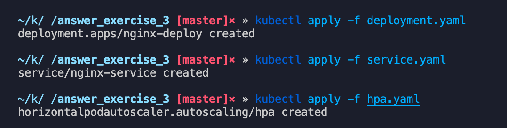
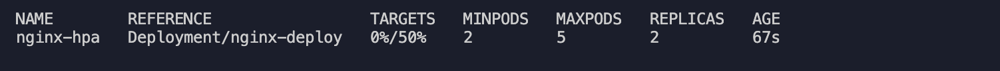
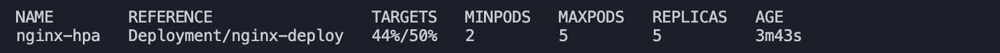
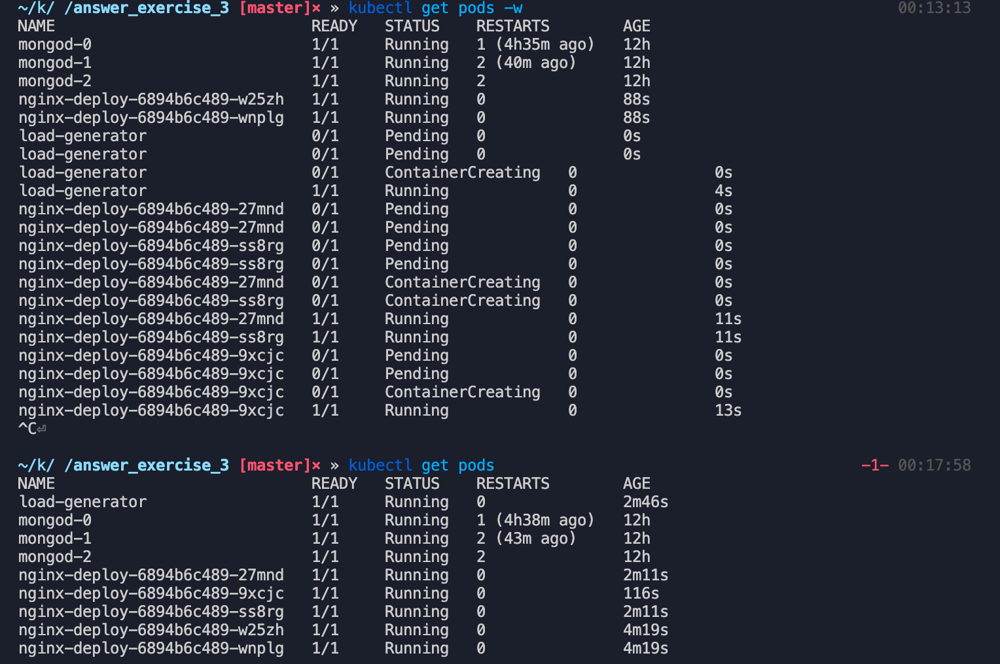

## Crea un objeto de kubernetes HPA, que escale a partir de las métricas CPU o memoria (a vuestra elección). Establece el umbral al 50% de CPU/memoria utilizada, cuando pase el umbral, automáticamente se deberá escalar al doble de replicas.

Activo el metrics-server para que HPA pueda observar el uso de la CPU


Creamos los objetos :


Observamos el hpa con el comando:

```jsx
kubectl get hpa nginx-hpa
```



Comenzamos a golpear el server nginx con:

```jsx
kubectl run -i --tty load-generator --rm --image=busybox --restart=Never -- /bin/sh -c "while sleep 0.00000000001; do wget -q -O- http://192.168.64.4:32703; done"
```

Después de casi 4m llega a escalar más que el doble y  no escala más porque esta por debajo del promedio 50%.



Podemos observar el watch de get pods, al final tenemos 5 pods.

